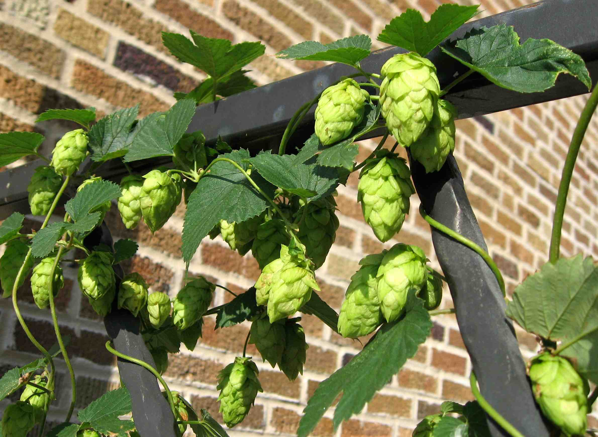

## Education

**Columbia University - Mailman School of Public Health**  
**Master of Public Health Candidate - May 2019**  
Department of Environmental Health Sciences  
Certificate: Applied Biostatistics  

**University of Wisconsin - Madison**  
**Bachelor of Science - December 2016**  
Major: Environmental Science  
Major: Agricultural & Applied Economics  
Certificate: Environmental Studies  

## Research

### Columbia Center for Children's Environmental Health

I currently work with Dr. Frederica Perera as a research assistant studying the effects of air pollution on children's health. More specifically, I am working on quantifying the economic benefits that accrue under different air pollution reduction policies. This involves utilizing the framework of [BenMAP-CE](https://www.epa.gov/benmap) to develop cost valuation functions for various children's health outcomes.

### University of Wisconsin - Madison Department of Plant Pathology

Prior to my graduate studies, I did research in the plant science world. I worked on developing virus eradication methods for hops plants, as a way to improve the viability of local hop production in a state with a long legacy of brewing. During this time, I worked in both greenhouse and laboratory settings, maintaining a collection of plants to purchase, as well as a tissue culture collection. 

